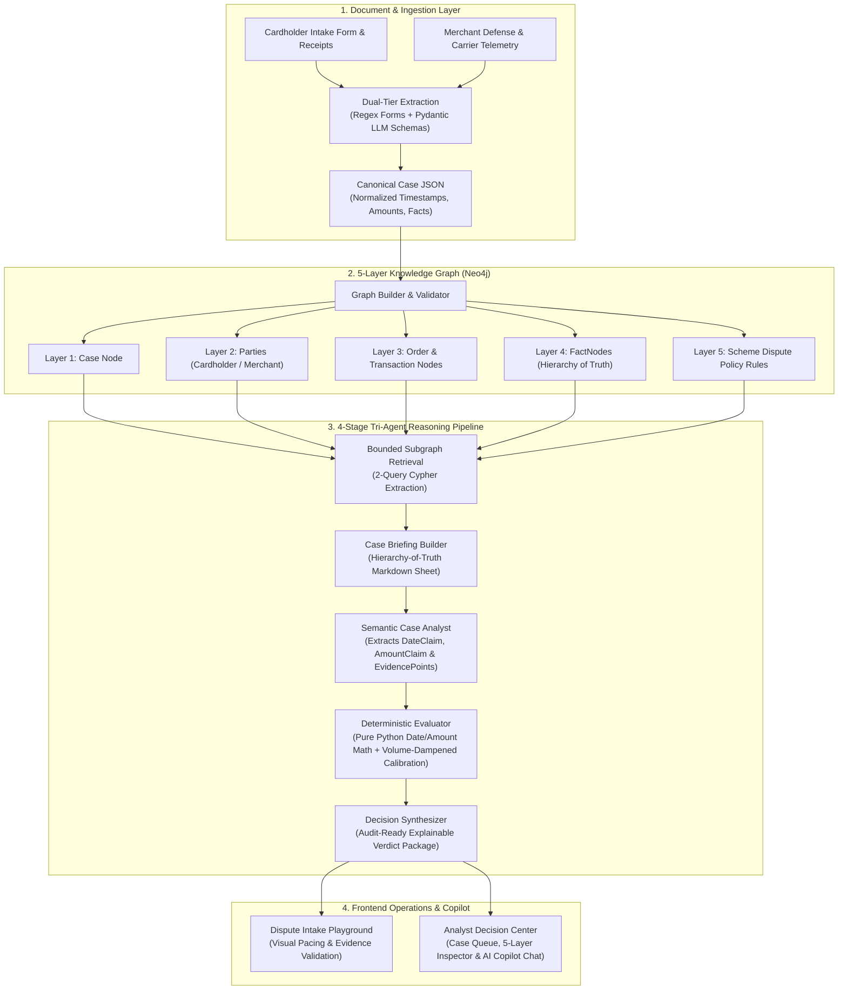

# 🛡️ DisputeSolver: Multi-Agent AI Dispute & Chargeback Resolution Engine

> **Autonomous Intake, 5-Layer Knowledge Graph Mapping, and Deterministic Explainable Reasoning with Human-in-the-Loop Analyst Governance.**

---

## 📌 Executive Overview & The Problem

Dispute and chargeback representment in payments and banking is historically broken:
* **Protracted 30–45 Day SLAs**: Manual back-and-forth between cardholders, issuing banks, acquiring processors, and merchants.
* **Cost & Overhead**: High operational costs for fraud analysts reviewing heterogeneous documents (PDF receipts, carrier scan photos, email screenshots, terms of service).
* **AI Hallucination & Decision Bias**: Naive LLM pipelines hallucinate math, misinterpret date windows, or produce artificially overconfident (99–100%) verdicts on sparse evidence.

**DisputeSolver** solves this with an explainable, multi-agent architecture:
1. Ingests raw dispute evidence into a typed **Canonical JSON** contract.
2. Structures entities, orders, evidence fact nodes, and dispute policies into a **5-Layer Neo4j Knowledge Graph**.
3. Evaluates claims using a **4-Stage Tri-Agent Reasoning Engine** where semantic extraction is separated from **pure Python deterministic math** (eliminating arithmetic hallucination).
4. Provides a **Dual-Mode Frontend**: an interactive **Intake Playground** (with work pacing and pre-flight validation alerts) and a full-featured **Analyst Decision Center** (with 5-layer graph inspection, an embedded Grounded AI Graph Copilot Chat, and binding Approval/Override audit logging).

---

## 🏛️ System Architecture



---

## ⚡ Key Capabilities & Engineering Features

### 1. Hierarchy of Truth Evidentiary Weighting
Evidence is objectively categorized into 3 strict tiers rather than treated equally:
* **Tier 1: Telemetry (Weight: 1.0)** — Tamper-resistant 3rd-party records (carrier GPS scans, delivery photos, 3DS cryptographic authentication, processor refund ARNs).
* **Tier 2: Business Records (Weight: 0.7)** — Contemporaneous timestamped emails, customer support tickets, accepted checkout terms of service.
* **Tier 3: Subjective Assertions (Weight: 0.35)** — Post-dispute complaint forms and merchant narrative assertions.

### 2. Volume-Dampened Calibrated Confidence Scoring
Unlike naive zero-sum ratios ($A / (A+B)$) that falsely hit 100% confidence even when only a single piece of evidence exists, DisputeSolver uses a volume-dampened calibration formula:
$$\text{volume\_factor} = \frac{\text{total\_evidence}}{\text{total\_evidence} + 2.0}$$
$$\text{calibrated\_pct} = 0.5 + (\text{raw\_ratio} - 0.5) \times \text{volume\_factor}$$
* Enforces a **92% confidence ceiling cap** to reflect inherent document-only uncertainty.
* Flags balanced evidence cases ($|\Delta| < 5\%$) as `CONTESTED / INSUFFICIENT_EVIDENCE` for manual review.

### 3. Interactive Dispute Intake Playground
* **End-to-End Simulation**: Test all 8 standard dispute categories.
* **UX Work Pacing**: Staggered pipeline milestones (800ms / 800ms / 600ms) revealing extraction $\to$ graph mapping $\to$ tri-agent evaluation.
* **Pre-Flight Validation Alerts**: Real-time warnings with interactive `+ Add Evidence` / `✓ Attached` toggles to prevent pipeline ingestion failures.
* **Dynamic SLA Metrics**: Computes actual cycle days vs standard 30d/45d card scheme baselines.

### 4. Analyst Resolution Dashboard & AI Graph Copilot
* **Central Queue & KPI Ribbon**: Real-time counters for pending reviews, approved resolutions, and human overrides.
* **5-Layer Knowledge Graph Explorer**: Visualizes entity nodes (`person`, `order`, `delivery`, `evidence`, `policy`) and relational bridges.
* **Grounded AI Graph Copilot (Chat)**: Natural language assistant answering questions directly from the case's graph topology, date gap checks, and scheme rules.
* **Human-in-the-Loop Governance**: One-click **Accept & Approve** or **Manual Override** with mandatory justification notes and audit logging.

---

## 📋 Supported Dispute Categories (8 Benchmark Scenarios)

| # | Category | Key Verification & Evidence Check |
| :--- | :--- | :--- |
| **0** | **Item Not Received** | Carrier delivery GPS scan & porch photo proof vs non-receipt claim |
| **1** | **Not as Described** | Photographic product hardware comparison vs catalog listing & return window |
| **2** | **Fraudulent Transaction** | 3DS cryptographic authentication & device fingerprint matching |
| **3** | **Duplicate Processing** | Processor authorization codes (ARN) & identical timestamp matching |
| **4** | **Credit Not Processed** | Merchant refund initiation timestamp vs 5-day scheme SLA window |
| **5** | **Canceled Subscription** | Cancellation timestamp vs recurring billing cycle cutoff date |
| **6** | **Incorrect Amount** | Authorization amount vs settlement charge math difference |
| **7** | **Weak Telemetry** | Absence of 3rd-party carrier tracking leading to cardholder refund |

---

## 📁 Repository Structure

```text
├── frontend/                          # Next.js 14 Interactive Analyst & Playground UI
│   ├── app/                           # App Router (page.tsx, layout.tsx, globals.css)
│   ├── components/                    # UI Components
│   │   ├── analyst-dashboard.tsx      # Case Queue, 5-Layer Graph & AI Copilot Chat
│   │   ├── dispute-playground.tsx     # Intake Simulation & Evidence Validation
│   │   └── ui/                        # Reusable UI Primitives (Button, Badge, etc.)
│   ├── data/                          # Benchmark Scenarios
│   │   └── scenarios.ts               # 8 Category Definitions & Resolution SLA Data
│   └── package.json
│
├── worker/                            # Python Backend & Multi-Agent Reasoning Engine
│   ├── agents/
│   │   ├── orchestrator.py            # End-to-end pipeline coordinator
│   │   ├── graph_retrieval.py         # 2-query Cypher retrieval layer
│   │   └── reasoning_engine/          # 4-Stage Reasoning Engine
│   │       ├── common.py              # Tier weights & Pydantic models
│   │       ├── case_briefing_builder.py # Markdown Briefing Sheet generator
│   │       ├── case_analyst.py        # Semantic contract parser
│   │       ├── deterministic_evaluator.py # Pure Python date/amount math & calibrated scoring
│   │       └── decision_synthesizer.py # Final JSON verdict package generator
│   ├── extraction/                    # Dual-tier Document & Form Extraction
│   │   ├── form_extractor.py          # Deterministic regex parser
│   │   ├── llm_extractor.py           # 12-schema Pydantic LLM extractor
│   │   └── master_canonical_builder.py# Canonical JSON builder
│   └── graph/                         # Neo4j 5-Layer Graph Architecture
│       ├── graph_schema.py            # Node & relationship definitions
│       ├── graph_builder.py           # FactNode & edge builder
│       └── graph_validator.py         # Graph consistency checks
│
├── WORK.md                            # Complete Engineering Journey, Retrospective & Codebase Guide
└── README.md                          # Project Documentation
```

---

## 🚀 Getting Started

### 1. Frontend Setup (Next.js)
```bash
cd frontend
npm install
npm run dev
```
Open [http://localhost:3000](http://localhost:3000) in your browser.

### 2. Backend Worker Setup (Python)
```bash
# Create and activate virtual environment
python -m venv venv
.\venv\Scripts\activate  # Windows
# source venv/bin/activate # macOS/Linux

# Install dependencies
pip install -r requirements.txt

# Run deterministic evaluation test
python -m worker.agents.reasoning_engine.deterministic_evaluator
```

---

## ⚠️ System Limitations & Operational Constraints

1. **Synthetic Benchmark Data**:
   * The cases in the playground are pre-compiled synthetic scenarios designed to reflect real-world dispute packets across all 8 major dispute categories.
2. **Self-Reported Evidence (Document-Level Ingestion)**:
   * Evidence in this MVP is evaluated directly from submitted documents (PDF receipts, carrier scan photos, email logs) based on internal timestamp and telemetry consistency. Direct live sandbox webhooks (e.g. live Stripe or EasyPost carrier API querying) are outside the current document-ingestion scope.
3. **Session-Based State**:
   * Analyst approval/override decisions and chat logs are maintained in reactive UI state for demonstration and testing. Production deployments would connect these events to persistent PostgreSQL / Redis audit tables.
