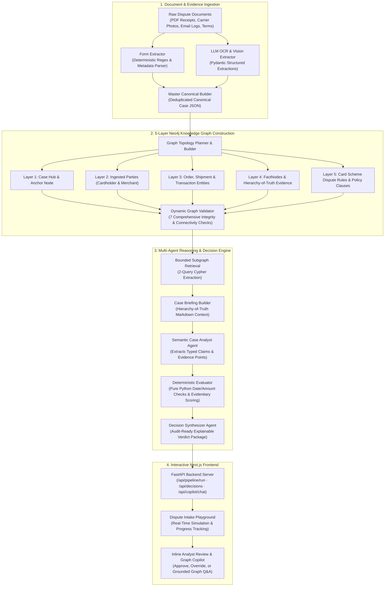

# ⚖️ DisputeSolver: Multi-Agent AI Chargeback & Dispute Reasoning Engine

DisputeSolver is an end-to-end automated chargeback defense and dispute resolution platform. It ingests cardholder dispute claims, merchant counter-evidence, and policy documents, builds a **5-layer knowledge graph in Neo4j**, and evaluates the case using a **tri-agent hybrid reasoning engine** (deterministic mathematical verification + semantic LLM evaluation).

---

## 🏗️ System Architecture & Backend Processing Workflow

The backend processes every dispute case through a structured 4-stage pipeline that guarantees deterministic accuracy, relational auditability, and explainable outcomes:



---

## ⚡ Key Capabilities & Engineering Features

### 1. Hierarchy of Truth Evidentiary Weighting
Evidence is objectively categorized into 3 strict tiers rather than treated equally:
* **Tier 1: Telemetry (Weight: 1.0)** — Tamper-resistant 3rd-party records (carrier GPS scans, delivery photos, 3DS cryptographic authentication, processor refund ARNs).
* **Tier 2: Business Records (Weight: 0.7)** — Contemporaneous timestamped emails, customer support tickets, accepted checkout terms of service.
* **Tier 3: Subjective Assertions (Weight: 0.35)** — Post-dispute complaint forms and merchant narrative assertions.

### 2. Multi-Tier Evidentiary Decision Scoring & Verification
* **Objective Weight Synthesis**: Evidence points are evaluated based on their source tier, reliability score, and directional support (Cardholder vs. Merchant).
* **Pure Python Date & Arithmetic Verifications**: Eliminates LLM hallucinations by calculating date gaps, refund SLA compliance windows, and transaction surcharge math using deterministic code.
* **Contested Case Detection**: Automatically flags cases with insufficient or conflicting evidence for manual analyst review rather than forcing an ungrounded automated verdict.

### 3. Interactive Dispute Intake Playground
* **End-to-End Simulation**: Test and trigger live multi-agent pipeline executions across all 8 standard dispute categories.
* **Synchronized 6-Stage Timeline**: Live progress tracking matching actual pipeline milestones (Dispute filed $\to$ Merchant notified $\to$ Defense submitted $\to$ OCR Extraction $\to$ 5-Layer Graph $\to$ Multi-Agent Decision).
* **Pre-Flight Validation & Error Recovery**: Real-time warnings with interactive evidence attachments and instant notification if the backend worker is offline.

### 4. Inline Analyst Investigation & Grounded AI Graph Copilot
* **Single-Page Investigation**: Integrated directly below the simulated resolution — eliminating dummy cross-case caching and keeping every review strictly scoped to the active case.
* **Grounded AI Graph Copilot**: Natural language assistant querying the active case's 5-layer Neo4j graph, domain relational bridges (`HAS_SHIPMENT`, `DELIVERED_TO`, etc.), and decision metrics.
* **Human-in-the-Loop Governance**: One-click **Approve & Execute** to transmit the verdict to the card scheme, or **Manual Override** with custom evidentiary justification notes and audit logging.

---

## 📋 Supported Dispute Categories (8 Benchmark Scenarios)

| # | Dispute Category | Description |
| :--- | :--- | :--- |
| **0** | **Item Not Received** | Cardholder claims package was not delivered; merchant provides carrier GPS delivery scan and porch photo. |
| **1** | **Not as Described** | Cardholder claims item differs from listing; evaluated via hardware specifications, receipt records, and return window. |
| **2** | **Fraudulent Transaction** | Cardholder claims unauthorized charge; verified against 3DS cryptographic authentication and device fingerprints. |
| **3** | **Duplicate Processing** | Cardholder disputes duplicate billing; evaluated against distinct checkout session IDs and timestamps. |
| **4** | **Credit Not Processed** | Cardholder claims unissued refund; evaluated against processor settlement logs and scheme refund windows. |
| **5** | **Canceled Recurring Transaction** | Disputed subscription billing; evaluated against cancellation timestamp vs post-cancellation stream access telemetry. |
| **6** | **Incorrect Transaction Amount** | Disputed dining surcharge; verified against itemized POS receipt and customer consent records. |
| **7** | **Weak Telemetry (Missing Tracking)** | Cardholder non-receipt claim where merchant lacks valid carrier tracking, leading to cardholder resolution. |

---

## 📁 Repository Structure

```text
├── frontend/                          # Next.js Interactive Analyst & Playground UI
│   ├── app/                           # App Router (page.tsx, layout.tsx, globals.css)
│   ├── components/                    # UI Components
│   │   ├── dispute-playground.tsx     # Intake Simulation, Evidence Validation & Inline Copilot
│   │   └── ui/                        # Reusable UI Primitives (Button, Badge, etc.)
│   ├── data/                          # Benchmark Scenarios
│   │   └── scenarios.ts               # 8 Category Definitions & Resolution SLA Data
│   ├── services/                      # API & Polling Layer
│   │   └── case-service.ts            # Client-side backend communication & Copilot requests
│   └── package.json
│
├── backend/                           # FastAPI REST API Layer
│   └── main.py                        # /api/pipeline/run, /api/decisions, /api/copilot/chat
│
├── worker/                            # Python Backend & Multi-Agent Reasoning Engine
│   ├── pipeline.py                    # Unified 4-stage pipeline execution runner
│   ├── agents/
│   │   ├── orchestrator.py            # End-to-end pipeline coordinator
│   │   ├── graph_retrieval.py         # 2-query Cypher retrieval layer
│   │   └── reasoning_engine/          # 4-Stage Reasoning Engine
│   │       ├── common.py              # Tier weights & Pydantic models
│   │       ├── case_briefing_builder.py # Markdown Briefing Sheet generator
│   │       ├── case_analyst.py        # Semantic contract parser
│   │       ├── deterministic_evaluator.py # Pure Python date/amount math & evidentiary scoring
│   │       └── decision_synthesizer.py # Final JSON verdict package generator
│   ├── extraction/                    # Dual-tier Document & Form Extraction
│   │   ├── form_extractor.py          # Deterministic regex parser
│   │   ├── llm_extractor.py           # 12-schema Pydantic LLM extractor
│   │   └── master_canonical_builder.py# Canonical JSON builder & merchant deduplication
│   └── graph/                         # Neo4j 5-Layer Graph Architecture
│       ├── graph_schema.py            # Node & relationship definitions
│       ├── graph_builder.py           # FactNode & edge builder
│       └── graph_validator.py         # 7 dynamic graph integrity checks
│
├── output/                            # Pipeline Results & Canonical Schemas
│   ├── extractions/                   # final_canonical_case_extractions.json
│   └── decisions/                     # Generated results_{case_id}.json decision packages
│
├── WORK.md                            # Complete Engineering Journey, Retrospective & Codebase Guide
└── README.md                          # Project Documentation
```

---

## 🚀 Getting Started

### 1. Frontend Setup (Next.js)
```bash
cd frontend
npm install
npm run dev
```
Open [http://localhost:3000](http://localhost:3000) in your browser.

### 2. Backend Worker Setup (FastAPI & Python)
```bash
# Create and activate virtual environment
python -m venv venv
.\venv\Scripts\activate  # Windows
# source venv/bin/activate # macOS/Linux

# Install dependencies
pip install -r requirements.txt

# Start the FastAPI server
uvicorn backend.main:app --port 8000 --reload
```

---

## ⚠️ System Limitations & Operational Constraints

1. **Synthetic Benchmark Data**:
   * The cases in the playground are pre-compiled synthetic scenarios designed to reflect real-world dispute packets across all 8 major dispute categories.
2. **Self-Reported Evidence (Document-Level Ingestion)**:
   * Evidence in this MVP is evaluated directly from submitted documents (PDF receipts, carrier scan photos, email logs) based on internal timestamp and telemetry consistency. Direct live sandbox webhooks (e.g. live Stripe or EasyPost carrier API querying) are outside the current document-ingestion scope.
3. **Session-Based State**:
   * Analyst approval/override decisions and chat logs are maintained in reactive UI state for demonstration and testing. Production deployments would connect these events to persistent PostgreSQL / Redis audit tables.
