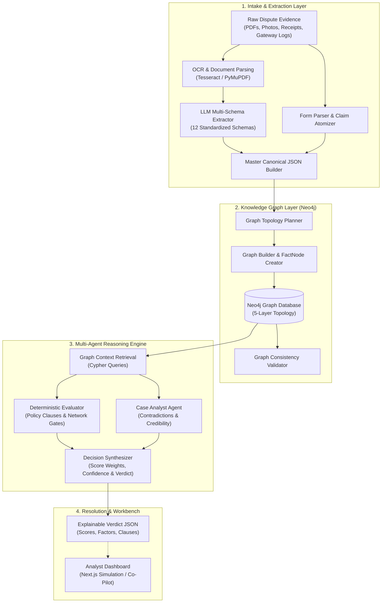
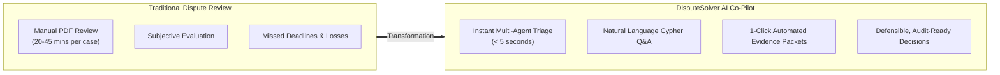

# ⚖️ DisputeSolver: AI-Powered Dispute & Chargeback Resolution Engine

An enterprise-grade, multi-agent AI system designed to automate and accelerate credit card dispute and chargeback investigations across major payment card networks (**Visa, Mastercard, American Express, Discover**).

DisputeSolver combines **Multi-Modal Document Extraction (OCR + LLMs)**, **Knowledge Graph Topology (Neo4j)**, and a **Tri-Agent Reasoning Engine** (Deterministic Rules + Semantic Analysis + Decision Synthesis) with an interactive **Examiner Workbench** to turn complex, multi-document chargeback disputes into transparent, explainable, and audit-ready verdicts in seconds.

---

## 📌 Table of Contents
- [Executive Overview](#-executive-overview)
- [Key Features & Capabilities](#-key-features--capabilities)
- [System Architecture](#-system-architecture)
  - [1. Universal Extraction Pipeline](#1-universal-extraction-pipeline)
  - [2. Knowledge Graph Layer](#2-knowledge-graph-layer)
  - [3. Multi-Agent Reasoning Engine](#3-multi-agent-reasoning-engine)
  - [4. Explainable Decision Output](#4-explainable-decision-output)
- [Frontend Simulation & Interactive Demo](#-frontend-simulation--interactive-demo)
- [Future Roadmap: The AI Dispute Assistant & Co-Pilot](#-future-roadmap-the-ai-dispute-assistant--co-pilot)
- [Supported Dispute Categories & Card Networks](#-supported-dispute-categories--card-networks)
- [Project Directory Structure](#-project-directory-structure)
- [Getting Started](#-getting-started)
  - [Backend Worker Setup](#backend-worker-setup)
  - [Frontend Simulation Setup](#frontend-simulation-setup)

---

## 🎯 Executive Overview

Handling payment disputes and chargebacks is traditionally a manual, error-prone, and expensive process. Dispute examiners must sift through dense PDFs, delivery photos, chat transcripts, payment gateway logs, and carrier tracking records while complying with rigid, network-specific rules (e.g., Visa 13.1, Mastercard 4855).

**DisputeSolver solves this by:**
1. **Eliminating Document Sifting:** Ingesting and normalizing unstructured evidence from both cardholder and merchant into a structured **Canonical JSON schema**.
2. **Grounding Facts in a Knowledge Graph:** Mapping entities, claims, evidence, and granular facts into a graph structure to detect contradictions, timeline gaps, and missing preconditions.
3. **Hybrid AI Decisioning:** Combining strict deterministic policy evaluation with semantic LLM evaluation to eliminate hallucinations and produce high-confidence, defensible recommendations.
4. **Empowering Human Analysts:** Providing an intuitive workbench where analysts can inspect graph relationships, review key decision factors, and make 1-click adjudications.

---

## 🚀 Key Features & Capabilities

- **Universal Multi-Format Intake:** Handles PDFs, scanned images (PNG, JPG, TIFF), raw text, and structured form submissions via automated OCR and schema-aware LLM extraction.
- **Card Network Rule Compliance:** Built-in rule catalog spanning Visa, Mastercard, American Express, and Discover reason codes.
- **5-Layer Knowledge Graph:** Connects Cases $\rightarrow$ Parties $\rightarrow$ Claims $\rightarrow$ Evidence Items $\rightarrow$ FactNodes in Neo4j for semantic queries and graph traversal.
- **Deterministic + Semantic Hybrid Logic:** 
  - *Deterministic Layer:* Validates policy notice windows, tracking status, AVS/CVV matching, and mandatory evidence checklists.
  - *Semantic Layer:* Evaluates narrative plausibility, tone, ambiguous terms, and nuanced customer-merchant communication logs.
- **Explainable Scoring Matrix:** Generates itemized point weightings, penalties, and confidence scores rather than black-box verdicts.
- **Interactive Analyst Workbench (Prototype):** Next.js & Tailwind CSS UI demonstrating real-time timeline tracking, evidence inspection, graph rendering, and recommendation breakdowns.

---

## 🏗️ System Architecture



---

### 1. Universal Extraction Pipeline
- **`document_text_extractor.py`**: Extracts text and tables from PDFs, text files, and OCR-scanned image files.
- **`llm_extractor.py`**: Routes document text to 12 target Pydantic schemas (e.g. `TrackingReport`, `PurchaseRecord`, `ProcessorLog`, `PoliceReport`, `UsageLog`, `CommunicationLog`).
- **`form_extractor.py`**: Atomizes freeform intake text into structured claims and assigns normalized dispute categories.
- **`master_canonical_builder.py`**: Assembles customer and merchant extractions into a single `final_canonical_case_extractions.json`.

---

### 2. Knowledge Graph Layer
Structured facts are transformed into a multi-layer graph topology stored in Neo4j:
- **Layer 1: Root & Parties:** `(:DisputeCase)` connected to `(:Merchant)`, `(:Customer)`, `(:Order)`, and `(:DisputeCategory)`.
- **Layer 2: Claims & Assertions:** `(:Claim)` nodes representing explicit assertions made by either party.
- **Layer 3: Evidence Files:** `(:Evidence)` nodes recording file metadata and submission origin.
- **Layer 4: FactNodes:** Granular, queryable records including `usage_event`, `processor_record`, `tracking_event`, `account_event`, `transaction_record`, and `policy_clause`.
- **Layer 5: Cross-Relationships:** `:SUPPORTS`, `:CONTRADICTS`, `:VERIFIES`, and `:FAILS_POLICY` relationships linking claims and evidence.

---

### 3. Multi-Agent Reasoning Engine

The reasoning engine runs an asynchronous 3-agent pipeline:

1. **Deterministic Evaluator (`deterministic_evaluator.py`):**
   - Applies rigid mathematical and boolean checks.
   - Evaluates merchant policy compliance (e.g., Clause 7.1 delivery confirmation, Clause 7.2 5-day notification window).
   - Validates card network mandatory evidence checklists.

2. **Case Analyst (`case_analyst.py`):**
   - Performs semantic examination of communications and statements.
   - Identifies subtle narrative discrepancies (e.g., customer claimed item never arrived, but support logs show inquiries on assembly instructions).

3. **Decision Synthesizer (`decision_synthesizer.py`):**
   - Calculates weighted scores (`merchant_score` vs `cardholder_score`).
   - Applies positive weights for verified carrier scans and matching AVS/CVV.
   - Applies penalties for false claims or missed policy deadlines.
   - Generates confidence scores and flags borderline cases ($< 0.80$) for human escalation.

---

### 4. Explainable Decision Output

Every resolved case produces a transparent, machine-readable verdict:

```json
{
  "case_id": "DSP-2026-00403",
  "verdict": "MERCHANT_FAVORED",
  "confidence_score": 0.91,
  "scores": {
    "merchant_score": 85,
    "cardholder_score": 20
  },
  "key_factors": [
    "Carrier proof of delivery with signature verification (+60 Merchant)",
    "3D-Secure authentication and AVS match confirmed (+25 Merchant)",
    "Cardholder notification filed outside the 5-day merchant policy window (-15 Cardholder)"
  ],
  "policy_evaluations": [
    {
      "clause_id": "7.1",
      "evaluation": "SATISFIES",
      "detail": "Carrier tracking report confirms delivery status as Delivered."
    },
    {
      "clause_id": "7.2",
      "evaluation": "EXPIRED",
      "detail": "Cardholder notified merchant 9 days post-delivery; exceeds 5-day limit."
    }
  ],
  "recommendation": "Deny chargeback; merchant has provided conclusive proof of delivery and authorization."
}
```

---

## 💻 Frontend Simulation & Interactive Demo

The `frontend/` folder contains an interactive, high-fidelity **Next.js & React prototype** showcasing how the system presents dispute intelligence to end users and operations teams.

> [!NOTE]
> **Prototype State:** The frontend is currently operating as a **simulation sandbox** using pre-configured scenario data (`frontend/data/scenarios.ts`). It is designed to illustrate the target visual UI, examiner workflow, and graph visualization before full live API integration with the Python backend.

### Simulation Highlights:
- **Multi-Scenario Switcher:** Switch between active dispute scenarios:
  - *Duplicate charge* (`Maya Chen` vs `Northstar Outfitters`)
  - *Item not received* (`Jordan Brooks` vs `Lumen Home`)
  - *Wrong amount* (`Riley Park` vs `Atlas Mobility`)
  - *Unauthorized payment* (`Avery Singh` vs `Garden State Market`)
- **Lifecycle Timeline:** Visual milestone stepper from *Case Created* $\rightarrow$ *Merchant Response* $\rightarrow$ *AI Investigation* $\rightarrow$ *Decision Ready*.
- **Interactive Evidence Inspector:** Side-by-side view of customer claims and merchant rebuttals with one-click inclusion/exclusion.
- **Topology Graph Visualizer:** Visual node representation of involved parties, payment captures, delivery scans, and authentication tokens.
- **AI Recommendation Panel:** Real-time breakdown of confidence metrics, reasoning questions, and decisive signals.


---

## 📊 Supported Dispute Categories & Card Networks

| Dispute Category              |
|-------------------------------|
| Product / Service Not Received|
| Not as Described / Quality    |
| Fraud / Unauthorized          |
| Duplicate Processing          |
| Credit Not Processed          |
| Canceled Subscription         |
| Incorrect Amount / Currency   |


---

## 📁 Project Directory Structure

```text
├── frontend/                          # Next.js Interactive Analyst UI Simulation
│   ├── app/                           # Next.js App Router (Layout & Pages)
│   ├── components/                    # UI Components & Dispute Playground
│   │   ├── dispute-playground.tsx     # Main Interactive Workbench Component
│   │   └── ui/                        # Reusable Primitive UI Components
│   ├── data/                          # Simulation Scenarios & Mock Datasets
│   │   └── scenarios.ts               # Scenario Definitions & Dummy Data
│   └── package.json                   # Frontend Dependencies & Scripts
│
├── worker/                            # Python Backend & Multi-Agent System
│   ├── agents/                        # Multi-Agent Reasoning Architecture
│   │   ├── dispute_config.py          # Network Rules & Category Configurations
│   │   ├── graph_retrieval.py         # Cypher Graph Query & Retrieval Layer
│   │   ├── orchestrator.py            # End-to-End Orchestrator Workflow
│   │   └── reasoning_engine/          # Modular Reasoning Engine
│   │       ├── common.py              # Pydantic Output Models & Types
│   │       ├── case_analyst.py        # Semantic Analysis Agent
│   │       ├── deterministic_evaluator.py # Deterministic Rule & Policy Gate
│   │       └── decision_synthesizer.py    # Score Weighing & Verdict Agent
│   │
│   ├── extraction/                    # Evidence & Document Extraction Pipeline
│   │   ├── document_text_extractor.py # OCR & PDF/Text Extractor
│   │   ├── form_extractor.py          # Claim Text & Intake Parser
│   │   ├── llm_extractor.py           # 12-Schema Pydantic LLM Extractor
│   │   └── master_canonical_builder.py# Canonical JSON Aggregator
│   │
│   └── graph/                         # Knowledge Graph Construction & Validation
│       ├── graph_schema.py            # 5-Layer Neo4j Schema Definitions
│       ├── graph_topology_planner.py  # Graph Normalization & Topology Planner
│       ├── graph_builder.py           # FactNode & Relationship Builder
│       └── graph_validator.py         # Graph Integrity & Consistency Validator
│
├── data/                              # Raw Sample Cases & Dispute Datasets
├── output/                            # Generated Canonical JSONs, Graphs & Verdicts
├── INFO.md                            # Network Reason Code & Evidence Matrix Reference
├── WORK.md                            # Development Plan, Architecture Notes & Audits
└── README.md                          # Project Documentation
```

---

## 🛠️ Getting Started

### Prerequisites
- **Python:** 3.11+
- **Node.js:** 18+ & `pnpm` (or `npm`)
- **Neo4j:** 5.x+ (Local or AuraDB instance)
- **Tesseract OCR:** (Optional, for image OCR processing)

---

### Backend Worker Setup

1. **Navigate to the root directory & create a virtual environment:**
   ```bash
   python -m venv venv
   # On Windows:
   .\venv\Scripts\activate
   # On Linux/macOS:
   source venv/bin/activate
   ```

2. **Install Python dependencies:**
   ```bash
   pip install -r requirements.txt
   ```

3. **Configure Environment Variables (`.env`):**
   ```env
   OPENAI_API_KEY="your-openai-api-key"
   # or GOOGLE_API_KEY="your-gemini-api-key"

   NEO4J_URI="bolt://localhost:7687"
   NEO4J_USER="neo4j"
   NEO4J_PASSWORD="your-password"
   ```

4. **Run the Orchestrator Pipeline on a test case:**
   ```bash
   python -m worker.agents.orchestrator --case-id DSP-2026-00187
   ```

---

### Frontend Simulation Setup

1. **Navigate to the frontend directory:**
   ```bash
   cd frontend
   ```

2. **Install dependencies:**
   ```bash
   pnpm install
   # or npm install
   ```

3. **Start the local development server:**
   ```bash
   pnpm dev
   # or npm run dev
   ```

4. **Open the interactive playground:**
   Open [http://localhost:3000](http://localhost:3000) in your browser to interact with the dispute simulation workbench.

---
## Limitations

- The data is used in this pipeline is generated synthetically by LLM.
- The data is just reflection how actual evidences in real world will look like 

## 🔮 Future Roadmap: The AI Dispute Assistant & Co-Pilot

The next evolution of DisputeSolver transitions the project from a standalone batch resolver to an **interactive AI Dispute Co-Pilot**:



### 1. Live Backend $\leftrightarrow$ Frontend API Integration
- Implement FastAPI REST and WebSocket endpoints connecting the Next.js frontend directly to the Python orchestrator and live Neo4j database.
- Stream agent reasoning steps in real-time to the UI.

### 2. Interactive Natural Language Examiner Co-Pilot
- Enable analysts to chat with the dispute graph in natural language:
  - *"Did the customer contact support before disputing?"*
  - *"Highlight any discrepancies between the carrier GPS coordinate and billing address."*
  - *"Show me all similar cases with this merchant over the last 90 days."*

### 3. Automated Network Evidence Packet Generation
- Generate formatted, network-compliant PDF response packets for Visa Resolve Online (VROL) and Mastercard MasterCom with 1 click.

### 4. Dynamic Human-in-the-Loop Workflow Modes
- **Mode A (Straight-Through Processing):** Auto-adjudicate high-confidence cases ($\ge 90\%$).
- **Mode B (Examiner Assisted):** Queue borderline or high-value cases for human review with pre-filled recommendations and key factor summaries.

### 5.Improving Data Quality For PlayGround
- Importing the real world data & converting playground simulation more robust & trustworthy


